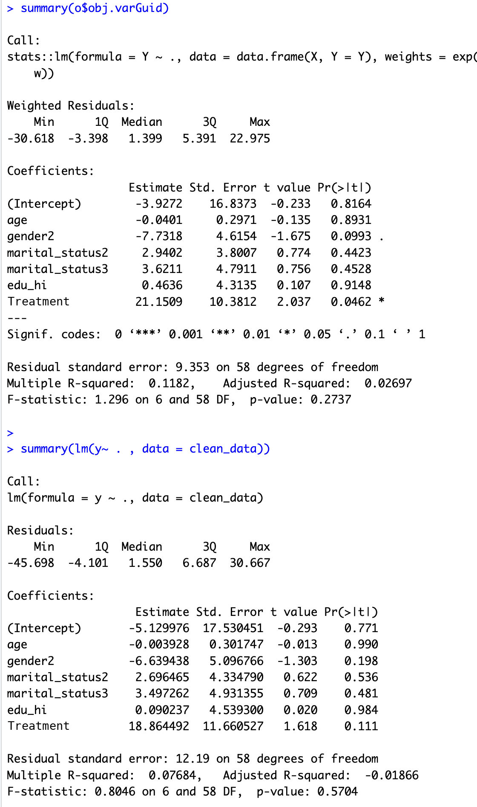
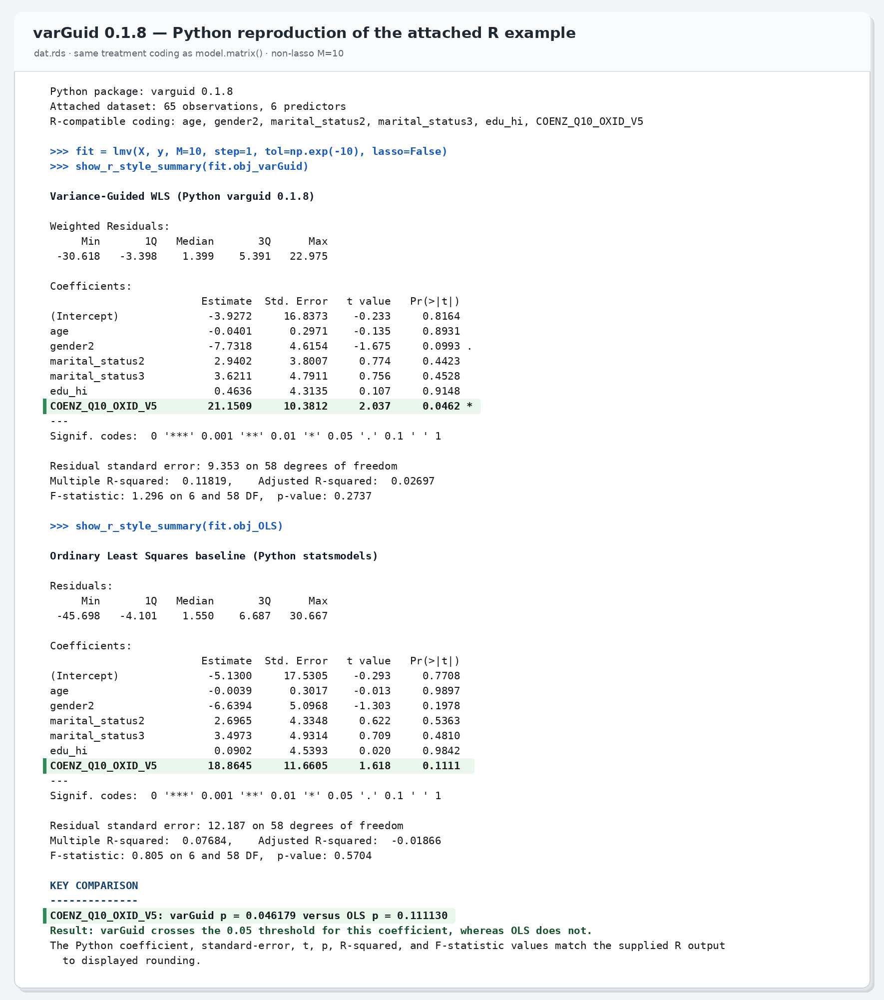

## varGuid: Variance-Guided Regression for OLS, ANOVA, and Lasso with a Nonlinear Prediction Extension

### Authors
Sibei Liu (sxl4188@miami.edu) and Min Lu (luminwin@gmail.com)

### Reference
Liu, S. and Lu, M. (2026). *Variance-Guided Regression for Heteroscedastic Data with a Grouping-Based Extension for Nonlinear Prediction*. *Statistics in Medicine*. 45(13-14):e70632. DOI: 10.1002/sim.70632

### Description
This GitHub development version of **varGuid** contains both parts of the Statistics in Medicine paper:

1. The Section 2 global linear mean-variance model via iteratively reweighted least squares (IRLS) and iteratively reweighted lasso estimation. The Section 2 code and help files are aligned with the CRAN `varGuid` 0.1.5 release.
2. The Section 3 grouping-based nonlinear prediction extension, implemented through `ymodv()` and `predict.varGuid()`.

The package supports general linear-model design matrices, including ANOVA-style encodings.

### Installation

Install the local convex-clustering dependency first, then install **varGuid**.

```r
install.packages("/YourFolder/cvxclustr_1.1.0.tar.gz", repos = NULL, type = "source")

## install.packages("devtools") ## install devtools if not already installed
devtools::install_github("luminwin/varGuid")
library(varGuid)
```

### Section 2 examples: global linear mean-variance model

```r
data(cobra2d, package = "varGuid")
dat <- cobra2d
set.seed(1)
tid <- sample(seq_len(nrow(dat)), 200)
train <- dat[-tid, ]
test <- dat[tid, ]
yid <- which(colnames(dat) == "y")
```

#### IRLS / weighted least squares fit

```r
o <- lmv(X = train[, -yid], Y = train[, yid], lasso = FALSE)
summary(o$obj.varGuid)  # varGuid weighted fit
summary(o$obj.OLS)      # baseline OLS fit

head(prd(o, train[, -yid], model = "baseline"))
head(prd(o, train[, -yid], model = "varGuid"))

# The corresponding base R calls are:
head(stats::predict(o$obj.OLS, newdata = as.data.frame(train[, -yid])))
head(stats::predict(o$obj.varGuid, newdata = as.data.frame(train[, -yid])))
```

#### Iteratively reweighted lasso fit

```r
o2 <- lmv(X = train[, -yid], Y = train[, yid], lasso = TRUE)
o2$beta            # varGuid-lasso coefficients
o2$obj.lasso$beta  # baseline lasso coefficients

head(prd(o2, train[, -yid], model = "baseline"))
head(prd(o2, train[, -yid], model = "varGuid"))

# The corresponding glmnet calls are:
head(drop(glmnet::predict.glmnet(o2$obj.lasso,
                                 newx = as.matrix(train[, -yid]))))
head(drop(glmnet::predict.glmnet(o2$obj.varGuid,
                                 newx = as.matrix(train[, -yid]))))
```

### Section 3 example: grouping-based nonlinear prediction

```r
# Create artificial grouping effects from a fitted Section 2 model.
y.obj <- ymodv(obj = o)

# Outcome prediction on new data.
pred <- predict.varGuid(mod = y.obj, lmvo = o, newdata = test[, -yid])

# RMSE.
sqrt(colMeans((matrix(replicate(ncol(pred), test[, yid]), ncol = ncol(pred)) - pred)^2,
              na.rm = TRUE))
```

Section 3 does not change the Section 2 coefficient estimates. It may be skipped unless nonlinear outcome prediction is required.

### Python implementation

A Python implementation is also available at <https://github.com/zionwzz/varGuid-python>. The screenshots below show the R output and the Python reproduction for the same Section 2 example, using the same treatment coding as R's `model.matrix()`.

<table>
<tr>
<td><strong>R varGuid output</strong></td>
<td><strong>Python varguid output</strong></td>
</tr>
<tr>
<td></td>
<td></td>
</tr>
</table>

To cite the Python package, use:

```bibtex
@software{wang_lu_2026_varguid_python,
author = {Wang, Zihao and Lu, Min},
title = {{varguid}: Variance-Guided Regression Improving Upon OLS and ANOVA for Python},
version = {0.1.8},
year = {2026},
doi = {10.5281/zenodo.XXXXXXX},
url = {https://github.com/zionwzz/varGuid-python}
}
```
